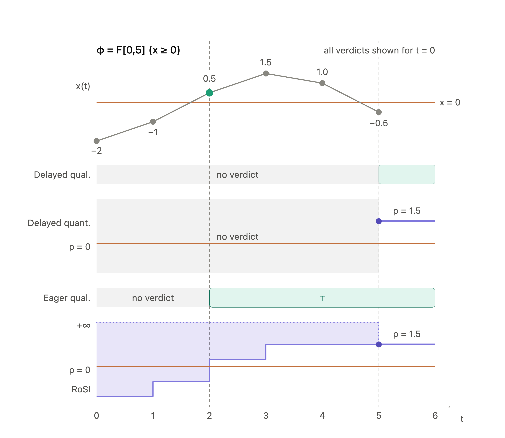

# mstlo

[](https://github.com/INTO-CPS-Association/mstlo/actions/workflows/rust.yml)
[](https://github.com/INTO-CPS-Association/mstlo/actions/workflows/python-tests.yml)
[](https://codecov.io/gh/INTO-CPS-Association/mstlo)
[](https://docs.rs/mstlo)
[](https://INTO-CPS-Association.github.io/mstlo/)
[](https://crates.io/crates/mstlo)
[](https://pypi.org/project/mstlo-python/)
[](https://pypi.org/project/mstlo-python/)
<!-- [](https://crates.io/crates/mstlo)
[](https://pypi.org/project/mstlo-python/) -->

mstlo (_mistletoe_) is a Rust library for online monitoring of Signal Temporal Logic (STL) specifications. It is designed for high performance and low memory usage, making it suitable for real-time applications. The Python bindings are published as `mstlo-python`.

- [mstlo](#mstlo)
  - [About](#about)
  - [Installation](#installation)
    - [Rust](#rust)
    - [Python](#python)
  - [Usage](#usage)
    - [Rust Usage](#rust-usage)
      - [Batch updates](#batch-updates)
    - [Python Usage](#python-usage)
  - [Theory](#theory)
    - [Signal Temporal Logic (STL)](#signal-temporal-logic-stl)
    - [Evaluation Semantics](#evaluation-semantics)
      - [Visual Comparison](#visual-comparison)
      - [Delayed Qualitative](#delayed-qualitative)
      - [Delayed Quantitative](#delayed-quantitative)
      - [Robust Satisfaction Intervals (RoSI)](#robust-satisfaction-intervals-rosi)
      - [Eager Qualitative](#eager-qualitative)
    - [Implementation](#implementation)
  - [Building from Source](#building-from-source)
    - [Prerequisites](#prerequisites)
    - [Rust Crate](#rust-crate)
    - [Python Bindings](#python-bindings)
  - [References](#references)
  - [License](#license)

## About

Cyber-Physical Systems (CPSs) increasingly rely on real-time fault detection and runtime monitoring to ensure safe operation. mstlo provides a unified monitoring interface that addresses the stringent performance requirements of these systems. Key features include:

- **Embedded DSL:** A macro-based DSL (`stl!`) allows specifications to be embedded and syntax-checked directly at compile time in Rust.
- **Unified Semantics Interface:** Supports multiple online evaluation modes (Qualitative, Quantitative, Eager, and RoSI) in a single framework.
- **Python Bindings:** Exposed via the `mstlo-python` package (import name: `mstlo_python`) to enable interactive workflows in environments like Jupyter Notebooks.
- **High Performance:** Benchmarks demonstrate throughput exceeding existing state-of-the-art tools.

Published package pages:

- Rust crate: [crates.io/crates/mstlo](https://crates.io/crates/mstlo)
- Python package: [pypi.org/project/mstlo-python](https://pypi.org/project/mstlo-python/)
- Rust API docs: [docs.rs/mstlo](https://docs.rs/mstlo)
- Python docs: [INTO-CPS-Association.github.io/mstlo](https://INTO-CPS-Association.github.io/mstlo/)

## Installation

### Rust

Add mstlo to your `Cargo.toml`:

```toml
[dependencies]
mstlo = "0.1.1"
mstlo = "0.1.1"
```

### Python

Install the Python bindings via pip:

```bash
pip install mstlo-python
```

## Usage

### Rust Usage

For more examples, see the [`mstlo/examples`](./mstlo/examples) directory.
The following snippet demonstrates how to create a monitor for the STL formula $\Box_{[0, 2]}(x > 5)$ using the embedded DSL and process incoming signal data.

mstlo utilizes the Builder pattern to configure the monitor's formula, semantics, and algorithm before processing the data stream.

```rust
use mstlo::monitor::{Rosi, StlMonitor};
use mstlo::{step, stl};
use std::time::Duration;

fn main() {
    // Define a formula using the embedded DSL
    let formula = stl! {G[0, 2](x > 5.0)};

    // Build the monitor
    let mut monitor = StlMonitor::builder()
        .formula(formula)
        .semantics(Rosi)
        .build()
        .expect("Failed to build monitor");

    // Feed data steps to the monitor
    let out1 = monitor.update(&step!("x", 7.0, 0s));
    println!("{:?}", out1.verdicts());
    // [Step { signal: "x", value: RobustnessInterval(-inf, 2.0), timestamp: 0ns }] // at time 0, robustness value is in interval (-inf, 2.0)
    let out2 = monitor.update(&step!("x", 4.0, 1s));
    println!("{:?}", out2.verdicts());
    // Output after second update: [Step { signal: "x", value: RobustnessInterval(-inf, -1.0), timestamp: 0ns }, Step { signal: "x", value: RobustnessInterval(-inf, -1.0), timestamp: 1s }] // early violation detection for times 0 and 1
}
```

#### Batch updates

Whole traces can be fed at once with `update_batch`, which accepts any iterable of steps. The `steps!` macro builds one, either signal-major (one trace per signal) or flat (interleaved samples):

```rust
use mstlo::monitor::{Rosi, StlMonitor};
use mstlo::{steps, stl};

let mut monitor = StlMonitor::builder()
    .formula(stl! {G[0, 2](x > 5.0) && (y < 10.0)})
    .semantics(Rosi)
    .initialize_signals_to_zero()
    .build()
    .expect("Failed to build monitor");

// Signal-major: the signal name is written once per trace.
let out = monitor.update_batch(&steps! {
    "x": [(7.0, 0s), (4.0, 1s), (6.0, 2s)],
    "y": [(3.0, 0s), (12.0, 2s)],
});
println!("{}", out); // all finalized verdicts

// Flat: each entry is exactly a `step!` argument list.
let out = monitor.update_batch(&steps![("x", 8.0, 3s), ("y", 1.0, 3s)]);
```

Steps are sorted by timestamp before evaluation, so a batch may be given in any order; the sort is stable, so the result is fully determined by the input sequence. In this example, signals are initialized to zero with `initialize_signals_to_zero()` to ensure all signals are defined at $t=0$s. The actual updates at this timepoint overrides the initialization values. It is also possible to manually initialize with values with `.initialize_signals([("x", 10.0), ("y", -120.0)])` instead.

### Python Usage

For more Python examples, see the [`mstlo-python/examples`](./mstlo-python/examples) directory.
The Python API wraps the core Rust engine, offering comparable performance via an intuitive Pythonic interface.

```python
import mstlo_python as mstlo

# Parse formula using the DSL syntax
phi = mstlo.parse_formula("G[0, 10](x > 5)")

# Create a monitor using the selected semantics
monitor = mstlo.Monitor(phi, semantics="Rosi")

# Update the monitor with streaming data (signal_name, value, timestamp)
output = monitor.update("x", 6.0, 0.5)

# Print formatted verdicts or extract structured data
print(f"Verdicts: {output.verdicts()}")
# Verdicts: [(0.5, (-inf, 1.0))] # (timestamp, (lower_bound, upper_bound) for robustness)
output = monitor.update("x", 3.0, 1.2)
print(f"Verdicts: {output.verdicts()}")
# Verdicts: [(0.5, (-inf, -2.0)), (1.2, (-inf, -2.0))] # early indication of violation
```

## Theory

### Signal Temporal Logic (STL)

Signal Temporal Logic (STL) [3] is a formalism for specifying properties of real-valued signals that evolve over time, providing a compact language to describe the desired behaviors of dynamic systems. STL evaluates properties over signals, which are defined as functions mapping a time domain (such as nonnegative real numbers, $\mathbb{R}_{\ge0}$) to a value domain.

mstlo focuses on bounded STL, meaning all temporal operators are constrained by finite time intervals of the form $[a, b]$, where $0 \le a < b$.
mstlo focuses on bounded STL, meaning all temporal operators are constrained by finite time intervals of the form $[a, b]$, where $0 \le a < b$.

The core syntax of STL is built from a minimal set of primitive operators:

- **True ($\top$)**: The Boolean constant True.

- **Atomic Predicates ($\mu(x) < c$)**: Evaluates to True if the function over the signal is less than a constant $c$.

- **Negation ($\neg\varphi$)**: The logical NOT of a formula.

- **Conjunction ($\varphi \wedge \psi$)**: The logical AND of two formulas.

- **Until ($\varphi \mathcal{U}_{[a,b]} \psi$)**: States that $\varphi$ must hold continuously until $\psi$ becomes true within the time interval $[a, b]$.

From these primitives, the library derives other highly useful operators to simplify specifications:

- **Disjunction (OR)**: $\varphi \vee \psi$

- **Implication**: $\varphi \rightarrow \psi$

- **Eventually**: $\diamondsuit_{[a,b]}\varphi$

- **Globally**: $\Box_{[a,b]}\varphi$

### Evaluation Semantics

See also [semantics-comparison.ipynb](mstlo-python/examples/semantics-comparison.ipynb) for an interactive demonstration of the different semantics.

An online monitor observes a system's behavior incrementally as discrete samples arrive. mstlo provides a unified interface supporting four distinct monitoring semantics, allowing users to trade off between expressiveness and verdict latency. In the following, we present the four semantics currently supported by mstlo.

For the temporal operators, $I$ is an interval $[a,b]$ with $b>a \geq 0$.

#### Visual Comparison

Consider the evaluation of the formula $\varphi = \Diamond_{[0,5]}(x\geq 0)$ over the signal $x=[-2,-1,0.5,1.5,1.0,-0.5]$ for timestamps $t=[0,1,2,3,4,5]$. The signal has temporal depth $H(\varphi)=5$.

Focusing on the verdict for $\tau=0$, it is clear that we can say that $\varphi$ is satisfied at $t=2s$. The two delayed semantics can, however, only produce a verdict when the temporal depth has elapsed, i.e. at $t=5s$. The eager qualitive semantics is able to report satisfaction already at time $t=2s$. Similarly, RoSI semantics report the interval $[0.5,\infty]$ at time $t=2s$, and since the lower bound is positive and the interval encloses all possible future robustness values, this corresponds to satisfaction as well. RoSI converges at the delayed quantitative verdict $\rho=1.5$ at time $t=5s$.

This is illustrated in the figure below:



#### Delayed Qualitative

The standard Boolean semantics of STL [3], where the monitor emits a strict true/false verdict only after observing enough of the signal (the temporal depth) to conclusively determine satisfaction or violation. Formally, the semantics are defined as follows:

$$
⟦ \cdot ⟧ : \mathrm{Formula} \to (\mathrm{Signal} \times \mathbb{T}) \to \mathbb{B}
$$

$$
⟦ \mu ⟧(s,t) = (s(t) \models \mu)
$$

$$
⟦ \neg \varphi ⟧ (s,t) = \neg ⟦ \varphi ⟧ (s,t)
$$

$$
⟦ \varphi_1 \land \varphi_2 ⟧(s,t) = ⟦ \varphi_1 ⟧(s,t) \land ⟦ \varphi_2 ⟧(s,t)
$$

$$
⟦ \varphi_1 \lor \varphi_2 ⟧(s,t) = ⟦ \varphi_1 ⟧(s,t) \lor ⟦ \varphi_2 ⟧(s,t)
$$

$$
⟦  \Box_I \varphi ⟧(s,t) = \forall t' \in t + I.\ ⟦ \varphi ⟧(s,t')
$$

$$
⟦ \Diamond_I \varphi ⟧(s,t) = \exists t' \in t + I.\ ⟦ \varphi ⟧(s,t')
$$

$$
⟦ \varphi \ \mathbf{U}_I\ \psi ⟧(s,t) = \exists t' \in t + I.\ (⟦ \psi ⟧(s,t') \land \forall t'' \in [t,t'].\ ⟦ \varphi ⟧(s,t''))
$$

#### Delayed Quantitative

The typical quantitative semantics of STL, as introduced by Donzé and Maler [1], computes a real-valued robustness score indicating the precise degree of satisfaction or violation. Similar to the qualitative mode, it requires full signal availability up to the temporal depth. It is defined as follows:

$$
\rho : \mathrm{Formula} \to (\mathrm{Signal} \times \mathbb{T}) \to \mathbb{R}
$$

$$
\rho(s_t, \mu_c) = c - \mu(x_t)
$$

$$
\rho(s_t, \neg\varphi)                 = -\rho(s_t, \varphi)
$$

$$
\rho(s_t, \varphi \wedge \psi)         = \min\left(\rho(s_t, \varphi), \rho(s_t, \psi)\right)
$$

$$
\rho(s_t, \varphi \vee \psi)           = \max\left(\rho(s_t, \varphi), \rho(s_t, \psi)\right)
$$

$$
\rho(s_t, \varphi \rightarrow \psi)    = \max\left(-\rho(s_t, \varphi), \rho(s_t, \psi)\right)
$$

$$
\rho(s_t, \Diamond_{I}\varphi)     = \max_{t' \in t+I} \rho(s_{t'}, \varphi)
$$

$$
\rho(s_t, \Box_{I}\varphi)         = \min_{t' \in t+I} \rho(s_{t'}, \varphi)
$$

$$
\rho(s_t, \varphi \ \mathbf{U}_I\ \psi) = \max_{t' \in t+I} \left(\min\left(\rho(s_{t'},\psi), \max_{t'' \in [t, t']} \rho(s_{t''},\varphi)\right)\right)
$$

#### Robust Satisfaction Intervals (RoSI)

As introduced by Deshmukh et al. [3], this semantics provides quantitative reasoning over partial traces. Instead of a single robustness value, the monitor computes an interval $[\rho_{min}, \rho_{max}]$ that encloses all possible future robustness values. A formula is definitively satisfied when $\rho_{min} > 0$ and definitively violated when $\rho_{max} < 0$. Formally, the semantics are defined as:

$$
[\rho] : \mathrm{Formula} \to (\mathrm{Signal} \times \mathbb{T}) \to \mathcal{I}(\mathbb{R})
$$

$$
[\rho](x_{[0,i]}, \tau, \mu_c)                    =
\begin{cases}
    [\mu(x_{[0,i]}(\tau)), \mu(x_{[0,i]}(\tau))] \text{if } \tau \in [t_0, t_i] \\
    [-\infty, \infty]                            \text{otherwise}
\end{cases}
$$

$$
[\rho](x_{[0,i]}, \tau, \neg\varphi)                 = -[\rho](x_{[0,i]}, \tau, \varphi)
$$

$$
[\rho](x_{[0,i]}, \tau, \varphi \wedge \psi)         = \min([\rho](x_{[0,i]}, \tau, \varphi), [\rho](x_{[0,i]}, \tau, \psi))
$$

$$
[\rho](x_{[0,i]}, \tau, \varphi \vee \psi)           = \max([\rho](x_{[0,i]}, \tau, \varphi), [\rho](x_{[0,i]}, \tau, \psi))
$$

$$
[\rho](x_{[0,i]}, \tau, \varphi \rightarrow \psi)    = \max(-[\rho](x_{[0,i]}, \tau, \varphi), [\rho](x_{[0,i]}, \tau, \psi))
$$

$$
[\rho](x_{[0,i]}, \tau, \Diamond_{I}\varphi)     = \sup_{t' \in \tau + I} \left([\rho](x_{[0,i]}, t', \varphi)\right)
$$

$$
[\rho](x_{[0,i]}, \tau, \Box_{I}\varphi)         = \inf_{t' \in \tau + I} \left([\rho](x_{[0,i]}, t', \varphi)\right)
$$

$$
[\rho](x_{[0,i]}, \tau, \varphi \ \mathbf{U}_I\ \psi )  = \sup_{t' \in \tau + I} \min\left( [\rho](x_{[0,i]}, t', \psi), \inf_{t'' \in [\tau, t']} [\rho](x_{[0,i]}, t'', \varphi) \right)
$$

Where $x_{[0,i]}$ is the signal prefix observed up to time $t_i$, $\tau$ is the timestamp of interest, and $\mathcal{I}(\mathbb{R})$ denotes the set of all intervals over the reals.

#### Eager Qualitative

Leverages the monotonicity in Boolean and temporal logic to emit early verdicts over partial traces. For example, a violation of a "globally" ($\mathbf{G}$) property immediately yields a false verdict without waiting for the full interval to elapse, and satisfaction of an "eventually" ($\mathbf{F}$) property yields a true verdict as soon as the condition is met. This semantics agrees with RoSI in terms of early verdicts but does not provide quantitative information, and is thus significantly more efficient to compute. The semantics alter the delayed qualitative semantics to work over partial traces, by introducing a set of short-circuiting rules.

## Implementation

To compute these semantics efficiently, mstlo uses a bottom-up dynamic programming approach, where each operator caches the verdicts of its suboperators, only maintaining the required state. For sliding window operations (like _eventually_ and _globally_), the library incorporates Lemire's algorithm to reduce cache footprints and computation time. The amount of reduction depends both on chosen semantics and signal characteristics.

### Signal Model

We assume a dense signal model: signals are real-valued and observed at real-valued timestamps that can arrive at any point in time, i.e. no sampling rate needs to be specified, samples need not be equally spaced, and different signals need not share timestamps.

As is often assumed for online monitors, we assume that signals have finite variability, meaning that for each signal $x^j$ observed as a sequence of time-value pairs $(t_0,x^j_0), \dots, (t_n,x^j_n)$ there exists some $\Delta^j > 0$ such that $t_{i+1}-t_i > \Delta^j$ for all $i \geq 0$. We do, however, not impose any restrictions on $\Delta^j$.

Since signals are defined densely but observed at discrete timestamps, the monitor must decide what a signal is between two samples. This is configured once for the whole monitor, and applies to every signal in the formula, whether there is one or several:

```rust
let monitor = StlMonitor::builder()
    .formula(stl! {G[0, 2](x > 4.0)})
    .semantics(DelayedQualitative)
    .signal_interpolation(SignalInterpolation::ZeroOrderHold) // the default
    .build()?;
```

No samples are synthesized between a signal's own samples; the interpolation is applied internally at the operator level. The one sample that is synthesized is each signal's value at $t=0$, see [Initialization of Signals](#initialization-of-signals).

#### Zero-Order Hold (default)

With `SignalInterpolation::ZeroOrderHold`, signals are piecewise constant: a sample holds until the next sample of the same signal. That is, for all $t\in [t_i, t_{i+1})$ we have $x^j(t)=x^j(t_i)$. This results in a staircase approximation between samples.

Two consequences follow:

- The value of a signal after its newest sample is not known until the next sample arrives, since that sample decides where the step ends. A delayed verdict at $t$ therefore waits for a sample at or after $t$; the eager semantics answer earlier where the prefix already decides the formula, and RoSI answers immediately with an interval it later refines.
- The verdicts are themselves a piecewise-constant signal: sorted by timestamp, a verdict at $t$ holds until the next verdict.

If the verdict of a specification changes between samples, the output contains verdicts for timestamps that were never input to the monitor. Each temporal operator shifts timestamps by its interval bounds to find where its verdict can change. We illustrate this with the following example:

Let the signal be given by $x=[1,1,7,1,1]$ for timestamps $t=[0,1,2,3,4]$ and the formula by `F[0,1](G[0.4,1](x > 3))`, under delayed qualitative semantics. Since $x>3$ only on $[2,3)$, the inner `G[0.4,1]` holds for $t\in[1.6,2)$. The property is therefore satisfied at $t=0.6$, since $1.6 \in [0.6+0,0.6+1]$ and $x>3$ on all of $[1.6+0.4,1.6+1.0]$. The monitor outputs:

| Input      | Verdicts emitted        |
| ---------- | ----------------------- |
| $x=1$ at 0 | –                       |
| $x=1$ at 1 | –                       |
| $x=7$ at 2 | 0: `false`              |
| $x=1$ at 3 | 0.6: `true`, 1: `true`  |
| $x=1$ at 4 | 1.6: `true`, 2: `false` |

Read as a signal, the property is violated on $[0,0.6)$, satisfied on $[0.6,2)$ and violated from $2$. Note that $0.6 = 2 - 1.4$ is the input timestamp shifted by both formulas' bounds.

#### Linear Interpolation

With `SignalInterpolation::Linear`, signals run in a straight line between consecutive samples: for $t\in[t_i,t_{i+1}]$, $x^j(t)=x^j_i + (x^j_{i+1}-x^j_i)\frac{t-t_i}{t_{i+1}-t_i}$.

Since predicates compare a signal against a constant, whether a predicate holds is still piecewise constant; it can only change where the line crosses the threshold. When a new sample arrives, the predicate computes the exact crossing time (rounded to nanoseconds) and emits it as an extra breakpoint. Every operator above the predicates is unchanged. This is illustrated with the following example:

For $x=6$ at $0$ and $x=2$ at $4$, $x$ crosses $4$ at $t=2$:

| Formula         | Zero-order hold       | Linear                            |
| --------------- | --------------------- | --------------------------------- |
| `x > 4`         | 0: `true`, 4: `false` | 0: `true`, 2: `false`, 4: `false` |
| `G[0,2](x > 4)` | 0: `true`, 2: `false` | 0: `false`, 2: `false`            |

Under linear interpolation, `G[0,2](x > 4)` is violated at $0$ because $x=4$ at the end of the closed window $[0,2]$.

Note that linear interpolation is only supported for the qualitative semantics (delayed and eager) with the incremental algorithm. Quantitative semantics (i.e. robustness values) are piecewise linear between samples, which is not implemented, so `build()` returns an error for delayed quantitative and RoSI semantics.

> The deprecated `synchronization_strategy(..)` maps `None` and `ZeroOrderHold` to `SignalInterpolation::ZeroOrderHold`, and `Linear` to `SignalInterpolation::Linear`.

### Input

Each sample is a `Step`: a signal name, a value, and a timestamp. In Rust the timestamp is a `Duration` (nanosecond resolution), e.g. `step!("x", 7.0, 1500ms)`; in Python it is in seconds, e.g. `monitor.update("x", 7.0, 1.5)`. Samples are given one at a time with `update`, or as a batch with `update_batch`, which sorts them by timestamp first.

- Timestamps must be strictly increasing per signal. A sample at or before the previous sample of the same signal is ignored, and a warning is printed.
- Samples of different signals may arrive interleaved in any pattern, and may share timestamps. Feed them in timestamp order across all signals to avoid potential excessive buffering.
- Each update returns a `MonitorOutput`. `verdicts()` gives the latest verdict per timestamp, while `raw_outputs()` also includes the intermediate refinements RoSI emits for the same timestamp.

#### Multiple Signals

When several signals are monitored, the formula's verdict can change at any sample of any of them, so every timestamp of every signal is a breakpoint. Under the delayed semantics a verdict is only given at $t$ once every signal the formula depends on is known at $t$. Signals are not resampled onto a common clock.

Let the formula be `(a > 0) && (b > 0)`, with $a=[1,-1,1]$ observed at $t_a=[0,2,4]$ and $b=[1,1]$ at $t_b=[0,5]$. The monitor outputs:

| Input       | Delayed               | Eager      |
| ----------- | --------------------- | ---------- |
| $a=1$ at 0  | –                     | –          |
| $b=1$ at 0  | 0: `true`             | 0: `true`  |
| $a=-1$ at 2 | –                     | 2: `false` |
| $a=1$ at 4  | –                     | –          |
| $b=1$ at 5  | 2: `false`, 4: `true` | 4: `true`  |

Under the delayed semantics the verdict at $0$ is given as soon as both signals are known there, but the verdicts at $2$ and $4$ wait for the sample of $b$ at $5$: until it arrives, $b$ could have changed anywhere after $0$. The eager semantics answer $2$ already at $a=-1$, since one false conjunct decides the conjunction on its own; $4$ still waits, since a true conjunct does not. Under both semantics the verdict at $5$ waits for the next sample of $a$.

Since a sample answers the timestamps that it decides rather than the ones that precede them, verdicts under the eager semantics need not be emitted in timestamp order. Let $a=[7,-4]$ be observed at $t_a=[0,2]$ and $b=[7,4]$ at $t_b=[0,1]$, arriving in the order $a(0), b(0), a(2), b(1)$:

| Input       | Verdicts emitted |
| ----------- | ---------------- |
| $a=7$ at 0  | –                |
| $b=7$ at 0  | 0: `true`        |
| $a=-4$ at 2 | 2: `false`       |
| $b=4$ at 1  | 1: `true`        |

The verdict at $1$ is emitted last, after the verdict at $2$, because it is the sample $b(1)$ that decides it.

#### Initialization of Signals

A signal is not extrapolated backwards from its first sample, so a formula over several signals would otherwise be read over a prefix where some of them do not exist yet. A monitor over more than one signal is therefore built with a value per signal, which that signal holds from $t=0$ until its own first sample:

```rust
let monitor = StlMonitor::builder()
    .formula(stl! {(x > 0.0) && (y > 0.0)})
    .semantics(EagerQualitative)
    .initialize_signals([("x", 0.0), ("y", 1.0)])
    .build()?;
```

`initialize_signals_to_zero()` fills in every signal that was not given a value, and `initialize_signal(name, value)` sets one. `build()` returns an error if a signal of a formula over several signals is left without a value. A formula over a single signal is defined wherever that signal is and needs no initial value; giving one has no effect. In Python the argument is `init_signals={"x": 0.0}` and anything left out is $0.0$, so a monitor always builds.

A signal that is really sampled at $t=0$ overrides its initial value, provided that sample arrives before the first sample past $t=0$; a trace that starts every signal together is therefore monitored exactly as it is written. For `(x > 0) && (y > 0)` with $x$ at $0, 1, 2, 3$ and $y$ first at $2.5$, the monitor reads $y$ as its initial value on $[0, 2.5)$ and gives verdicts from $0$.

<!-- README.md: the batch-update snippet (`G[0, 2](x > 5.0) && (y < 10.0)`) is over two signals
and no longer builds as written. It needs a line such as
`.initialize_signals([("x", 7.0), ("y", 3.0)])` before `.build()`. Both signals are sampled at
0s there, so the values are never read and the verdicts are unchanged. -->

#### Refinable Verdicts

The RoSI semantics are the only ones that answer a timestamp before the trace decides it. A verdict is emitted as soon as the timestamp exists, and re-emitted, narrower, as samples arrive; a bound sits at $\pm\infty$ for as long as the prefix admits a continuation that would move it. `verdicts()` keeps the newest interval per timestamp, `raw_outputs()` every refinement in the order produced.

An interval collapses to a point once every signal is known at $t+h$, where $h$ is the formula's horizon: the interval upper bounds summed along its deepest chain of temporal operators. That point is the delayed robustness value, so the two semantics agree wherever the delayed one answers. For `G[0,1.5]((x > 0) -> F[0.5,2](y > 0))` the horizon is $1.5+2=3.5$, and feeding $x$ at $0,1,2,3.5$ and $y$ at $1,3.5$ gives $(-\infty,\infty)$ at $t=0$ on every update until the samples at $3.5$ arrive, which finalize it at $(1,1)$.

### Settings that can hurt performance

There are certain settings where the combination of formula and signal characteristics can significantly impact performance.

**Signals that are not observed.** If more than one signal is monitored, it is expected that all signals are eventually observed. Since verdicts wait for every signal they depend on, a signal that stops arriving makes pending verdicts pile up, and memory usage grows. For instance, consider the bounded response property `G[0,a]((x > 0) -> F[b,c](y > 0))`. If we observe $x$ and $y$ at $t=0$ and then keep observing only $x$, every new sample of $x$ adds pending state. $y$ can potentially still arrive, so nothing can be released. Once $y$ arrives, all pending verdicts are emitted at once.

**Refinable verdicts over a long trace.** A timestamp answered under the interval semantics stays live until it is final, and is re-emitted on each update that narrows it. The work per update therefore grows with how many timestamps are still open, which is set by the formula's horizon and the sample rate, and the output carries the refinements as well as the verdicts. On a formula with wide intervals over a long trace this is orders of magnitude more expensive than the delayed semantics, which emit each timestamp once.

**Timestamps that do not align with the formula's bounds.** A temporal operator with interval $[a,b]$ evaluates at $t$, $t-a$ and $t-b$ for each breakpoint $t$ of its operand. On a regular grid with bounds that are multiples of the sample period these coincide with existing timestamps. Otherwise each sample adds new evaluation timestamps, and this compounds with nesting (see $0.6$ and $1.6$ in the example above). Linear interpolation adds a breakpoint at each threshold crossing on top of this.

## Building from Source

### Prerequisites

- [Rust](https://rustup.rs/) (stable toolchain)
- [Python 3.9+](https://www.python.org/) and [maturin](https://github.com/PyO3/maturin) (for Python bindings only)

### Rust Crate

```bash
git clone https://github.com/INTO-CPS-Association/mstlo.git
cd mstlo/mstlo
cargo build
```

Run the test suite:

```bash
cargo test
```

Run the included examples:

```bash
cargo run --example intro_example
cargo run --example simple_example
cargo run --example variables_example
```

### Python Bindings

```bash
cd mstlo-python
pip install maturin
maturin develop
```

Run the Python tests:

```bash
pip install pytest
pytest
```

## References

[1] A. Donzé and O. Maler, “Robust Satisfaction of Temporal Logic over Real-Valued Signals,” in Formal Modeling and
Analysis of Timed Systems, K. Chatterjee and T. A. Henzinger, Eds., Berlin, Heidelberg: Springer, 2010, pp. 92–106. doi:
[10.1007/978-3-642-15297-9_9.](https://doi.org/10.1007/978-3-642-15297-9_9)

[2] J. V. Deshmukh, A. Donzé, S. Ghosh, X. Jin, G. Juniwal, and S. A. Seshia, “Robust online monitoring of signal
temporal logic,” Form Methods Syst Des, vol. 51, no. 1, pp. 5–30, Aug. 2017, doi: [10.1007/s10703-017-0286-7.](https://doi.org/10.1007/s10703-017-0286-7)

[3] O. Maler and D. Nickovic, “Monitoring Temporal Properties of Continuous Signals,” in Formal Techniques, Modelling
and Analysis of Timed and Fault-Tolerant Systems, Y. Lakhnech and S. Yovine, Eds., Berlin, Heidelberg: Springer, 2004, pp. 152–166. doi: [10.1007/978-3-540-30206-3_12](https://doi.org/10.1007/978-3-540-30206-3_12).

[4] D. Lemire, “Streaming maximum-minimum filter using no more than three comparisons per element,” Nordic J. of Computing, vol. 13, no. 4, pp. 328–339, Dec. 2006.

## License

This project is distributed under the INTO-CPS Association Public License (ICAPL) with GPL v3 as a supported subsidiary mode. See `LICENSE` for the full terms and `ICA-USAGE-MODE.txt` for the selected usage mode in this distribution.
