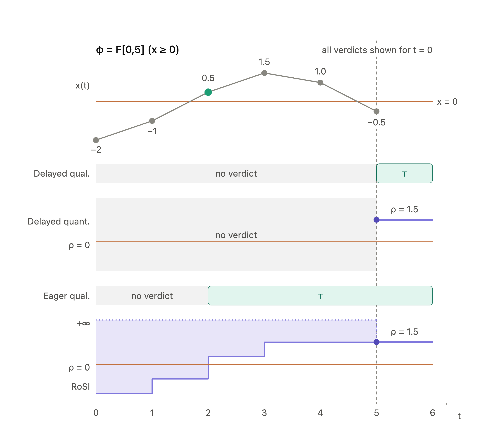

# Signal Temporal Logic and Evaluation Semantics

This page covers the logic mstlo monitors and the four online semantics it can evaluate it under. For how the monitor reads signals and when it emits verdicts, see [Implementation](implementation.md).

<!-- TOC -->

- [Signal Temporal Logic and Evaluation Semantics](#signal-temporal-logic-and-evaluation-semantics)
  - [Signal Temporal Logic (STL)](#signal-temporal-logic-stl)
  - [Evaluation Semantics](#evaluation-semantics)
    - [Visual Comparison](#visual-comparison)
    - [Delayed Qualitative](#delayed-qualitative)
    - [Delayed Quantitative](#delayed-quantitative)
    - [Robust Satisfaction Intervals (RoSI)](#robust-satisfaction-intervals-rosi)
    - [Eager Qualitative](#eager-qualitative)
  - [References](#references)

<!-- /TOC -->

## Signal Temporal Logic (STL)

Signal Temporal Logic (STL) [3] is a formalism for specifying properties of real-valued signals that evolve over time, providing a compact language to describe the desired behaviors of dynamic systems. STL evaluates properties over signals, which are defined as functions mapping a time domain (such as nonnegative real numbers, $\mathbb{R}_{\ge0}$) to a value domain.

mstlo focuses on bounded STL, meaning all temporal operators are constrained by finite time intervals of the form $[a, b]$, where $0 \le a < b$.

The core syntax of STL is built from a minimal set of primitive operators:

- **True ($\top$)**: The Boolean constant True.

- **Atomic Predicates ($\mu(x) < c$)**: Evaluates to True if the function over the signal is less than a constant $c$.

- **Negation ($\neg\varphi$)**: The logical NOT of a formula.

- **Conjunction ($\varphi \wedge \psi$)**: The logical AND of two formulas.

- **Until ($\varphi \mathcal{U}_{[a,b]} \psi$)**: States that $\varphi$ must hold continuously until $\psi$ becomes true within the time interval $[a, b]$.

From these primitives, the library derives other highly useful operators to simplify specifications:

- **Disjunction (OR)**: $\varphi \vee \psi$

- **Implication**: $\varphi \rightarrow \psi$

- **Eventually**: $\diamondsuit_{[a,b]}\varphi$

- **Globally**: $\Box_{[a,b]}\varphi$

## Evaluation Semantics

See also [semantics-comparison.ipynb](../mstlo-python/examples/semantics-comparison.ipynb) for an interactive demonstration of the different semantics.

An online monitor observes a system's behavior incrementally as discrete samples arrive. mstlo provides a unified interface supporting four distinct monitoring semantics, allowing users to trade off between expressiveness and verdict latency. In the following, we present the four semantics currently supported by mstlo.

For the temporal operators, $I$ is an interval $[a,b]$ with $b>a \geq 0$.

### Visual Comparison

Consider the evaluation of the formula $\varphi = \Diamond_{[0,5]}(x\geq 0)$ over the signal $x=[-2,-1,0.5,1.5,1.0,-0.5]$ for timestamps $t=[0,1,2,3,4,5]$. The formula has temporal depth $H(\varphi)=5$.

Focusing on the verdict for $\tau=0$, it is clear that we can say that $\varphi$ is satisfied at $t=2s$. The two delayed semantics can, however, only produce a verdict when the temporal depth has elapsed, i.e. at $t=5s$. The eager qualitative semantics is able to report satisfaction already at time $t=2s$. Similarly, RoSI semantics report the interval $[0.5,\infty]$ at time $t=2s$, and since the lower bound is positive and the interval encloses all possible future robustness values, this corresponds to satisfaction as well. RoSI converges at the delayed quantitative verdict $\rho=1.5$ at time $t=5s$.

This is illustrated in the figure below:

### Delayed Qualitative

The standard Boolean semantics of STL [3], where the monitor emits a strict true/false verdict only after observing enough of the signal (the temporal depth) to conclusively determine satisfaction or violation. Formally, the semantics are defined as follows:

$$
⟦ \cdot ⟧ : \mathrm{Formula} \to (\mathrm{Signal} \times \mathbb{T}) \to \mathbb{B}
$$

$$
⟦ \mu ⟧(s,t) = (s(t) \models \mu)
$$

$$
⟦ \neg \varphi ⟧ (s,t) = \neg ⟦ \varphi ⟧ (s,t)
$$

$$
⟦ \varphi_1 \land \varphi_2 ⟧(s,t) = ⟦ \varphi_1 ⟧(s,t) \land ⟦ \varphi_2 ⟧(s,t)
$$

$$
⟦ \varphi_1 \lor \varphi_2 ⟧(s,t) = ⟦ \varphi_1 ⟧(s,t) \lor ⟦ \varphi_2 ⟧(s,t)
$$

$$
⟦  \Box_I \varphi ⟧(s,t) = \forall t' \in t + I.\ ⟦ \varphi ⟧(s,t')
$$

$$
⟦ \Diamond_I \varphi ⟧(s,t) = \exists t' \in t + I.\ ⟦ \varphi ⟧(s,t')
$$

$$
⟦ \varphi \ \mathbf{U}_I\ \psi ⟧(s,t) = \exists t' \in t + I.\ (⟦ \psi ⟧(s,t') \land \forall t'' \in [t,t'].\ ⟦ \varphi ⟧(s,t''))
$$

### Delayed Quantitative

The typical quantitative semantics of STL, as introduced by Donzé and Maler [1], computes a real-valued robustness score indicating the precise degree of satisfaction or violation. Similar to the qualitative mode, it requires full signal availability up to the temporal depth. It is defined as follows:

$$
\rho : \mathrm{Formula} \to (\mathrm{Signal} \times \mathbb{T}) \to \mathbb{R}
$$

$$
\rho(s_t, \mu_c) = c - \mu(x_t)
$$

$$
\rho(s_t, \neg\varphi)                 = -\rho(s_t, \varphi)
$$

$$
\rho(s_t, \varphi \wedge \psi)         = \min\left(\rho(s_t, \varphi), \rho(s_t, \psi)\right)
$$

$$
\rho(s_t, \varphi \vee \psi)           = \max\left(\rho(s_t, \varphi), \rho(s_t, \psi)\right)
$$

$$
\rho(s_t, \varphi \rightarrow \psi)    = \max\left(-\rho(s_t, \varphi), \rho(s_t, \psi)\right)
$$

$$
\rho(s_t, \Diamond_{I}\varphi)     = \max_{t' \in t+I} \rho(s_{t'}, \varphi)
$$

$$
\rho(s_t, \Box_{I}\varphi)         = \min_{t' \in t+I} \rho(s_{t'}, \varphi)
$$

$$
\rho(s_t, \varphi \ \mathbf{U}_I\ \psi) = \max_{t' \in t+I} \left(\min\left(\rho(s_{t'},\psi), \max_{t'' \in [t, t']} \rho(s_{t''},\varphi)\right)\right)
$$

### Robust Satisfaction Intervals (RoSI)

As introduced by Deshmukh et al. [2], this semantics provides quantitative reasoning over partial traces. Instead of a single robustness value, the monitor computes an interval $[\rho_{min}, \rho_{max}]$ that encloses all possible future robustness values. A formula is definitively satisfied when $\rho_{min} > 0$ and definitively violated when $\rho_{max} < 0$. Formally, the semantics are defined as:

$$
[\rho] : \mathrm{Formula} \to (\mathrm{Signal} \times \mathbb{T}) \to \mathcal{I}(\mathbb{R})
$$

$$
[\rho](x_{[0,i]}, \tau, \mu_c)                    =
\begin{cases}
    [\mu(x_{[0,i]}(\tau)), \mu(x_{[0,i]}(\tau))] \text{if } \tau \in [t_0, t_i] \\
    [-\infty, \infty]                            \text{otherwise}
\end{cases}
$$

$$
[\rho](x_{[0,i]}, \tau, \neg\varphi)                 = -[\rho](x_{[0,i]}, \tau, \varphi)
$$

$$
[\rho](x_{[0,i]}, \tau, \varphi \wedge \psi)         = \min([\rho](x_{[0,i]}, \tau, \varphi), [\rho](x_{[0,i]}, \tau, \psi))
$$

$$
[\rho](x_{[0,i]}, \tau, \varphi \vee \psi)           = \max([\rho](x_{[0,i]}, \tau, \varphi), [\rho](x_{[0,i]}, \tau, \psi))
$$

$$
[\rho](x_{[0,i]}, \tau, \varphi \rightarrow \psi)    = \max(-[\rho](x_{[0,i]}, \tau, \varphi), [\rho](x_{[0,i]}, \tau, \psi))
$$

$$
[\rho](x_{[0,i]}, \tau, \Diamond_{I}\varphi)     = \sup_{t' \in \tau + I} \left([\rho](x_{[0,i]}, t', \varphi)\right)
$$

$$
[\rho](x_{[0,i]}, \tau, \Box_{I}\varphi)         = \inf_{t' \in \tau + I} \left([\rho](x_{[0,i]}, t', \varphi)\right)
$$

$$
[\rho](x_{[0,i]}, \tau, \varphi \ \mathbf{U}_I\ \psi )  = \sup_{t' \in \tau + I} \min\left( [\rho](x_{[0,i]}, t', \psi), \inf_{t'' \in [\tau, t']} [\rho](x_{[0,i]}, t'', \varphi) \right)
$$

Where $x_{[0,i]}$ is the signal prefix observed up to time $t_i$, $\tau$ is the timestamp of interest, and $\mathcal{I}(\mathbb{R})$ denotes the set of all intervals over the reals.

How RoSI intervals narrow as samples arrive is described in [Refinable Verdicts](implementation.md#refinable-verdicts).

### Eager Qualitative

Leverages the monotonicity in Boolean and temporal logic to emit early verdicts over partial traces. For example, a violation of a "globally" ($\mathbf{G}$) property immediately yields a false verdict without waiting for the full interval to elapse, and satisfaction of an "eventually" ($\mathbf{F}$) property yields a true verdict as soon as the condition is met. This semantics agrees with RoSI in terms of early verdicts but does not provide quantitative information, and is thus significantly more efficient to compute. The semantics alter the delayed qualitative semantics to work over partial traces, by introducing a set of short-circuiting rules.

## References

[1] A. Donzé and O. Maler, “Robust Satisfaction of Temporal Logic over Real-Valued Signals,” in Formal Modeling and
Analysis of Timed Systems, K. Chatterjee and T. A. Henzinger, Eds., Berlin, Heidelberg: Springer, 2010, pp. 92–106. doi:
[10.1007/978-3-642-15297-9_9.](https://doi.org/10.1007/978-3-642-15297-9_9)

[2] J. V. Deshmukh, A. Donzé, S. Ghosh, X. Jin, G. Juniwal, and S. A. Seshia, “Robust online monitoring of signal
temporal logic,” Form Methods Syst Des, vol. 51, no. 1, pp. 5–30, Aug. 2017, doi: [10.1007/s10703-017-0286-7.](https://doi.org/10.1007/s10703-017-0286-7)

[3] O. Maler and D. Nickovic, “Monitoring Temporal Properties of Continuous Signals,” in Formal Techniques, Modelling
and Analysis of Timed and Fault-Tolerant Systems, Y. Lakhnech and S. Yovine, Eds., Berlin, Heidelberg: Springer, 2004, pp. 152–166. doi: [10.1007/978-3-540-30206-3_12](https://doi.org/10.1007/978-3-540-30206-3_12).
